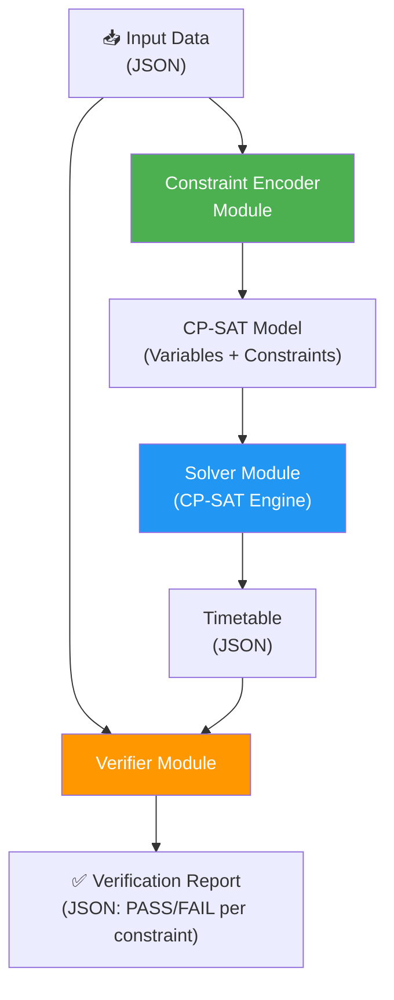

```mermaid
flowchart TD
    A["📥 Input Data\n(JSON)"] --> B["Constraint Encoder\nModule"]
    B --> C["CP-SAT Model\n(Variables + Constraints)"]
    C --> D["Solver Module\n(CP-SAT Engine)"]
    D --> E["Timetable\n(JSON)"]
    A --> F["Verifier Module"]
    E --> F
    F --> G["✅ Verification Report\n(JSON: PASS/FAIL per constraint)"]

    style B fill:#4CAF50,color:#fff
    style D fill:#2196F3,color:#fff
    style F fill:#FF9800,color:#fff
```
