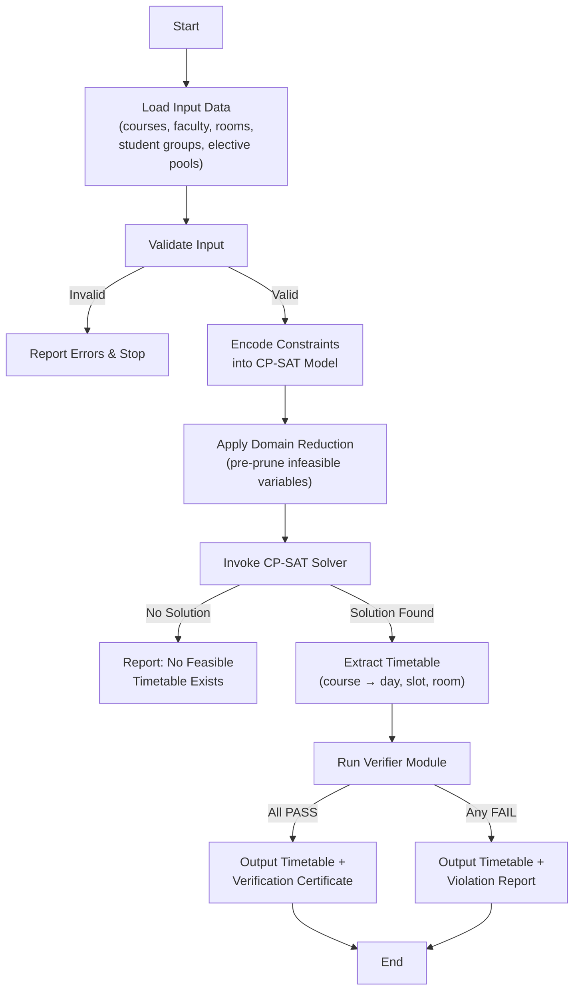

```mermaid
flowchart TD
    A["Start"] --> B["Load Input Data\n(courses, faculty, rooms,\nstudent groups, elective pools)"]
    B --> C["Validate Input"]
    C -->|Invalid| D["Report Errors & Stop"]
    C -->|Valid| E["Encode Constraints\ninto CP-SAT Model"]
    E --> F["Apply Domain Reduction\n(pre-prune infeasible variables)"]
    F --> G["Invoke CP-SAT Solver"]
    G -->|No Solution| H["Report: No Feasible\nTimetable Exists"]
    G -->|Solution Found| I["Extract Timetable\n(course → day, slot, room)"]
    I --> J["Run Verifier Module"]
    J -->|All PASS| K["Output Timetable +\nVerification Certificate"]
    J -->|Any FAIL| L["Output Timetable +\nViolation Report"]
    K --> M["End"]
    L --> M
```
