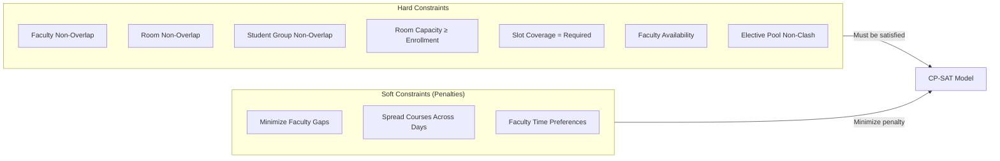

```mermaid
flowchart LR
    subgraph HC["Hard Constraints"]
        H1["Faculty Non-Overlap"]
        H2["Room Non-Overlap"]
        H3["Student Group Non-Overlap"]
        H4["Room Capacity ≥ Enrollment"]
        H5["Slot Coverage = Required"]
        H6["Faculty Availability"]
        H7["Elective Pool Non-Clash"]
    end

    subgraph SC["Soft Constraints (Penalties)"]
        S1["Minimize Faculty Gaps"]
        S2["Spread Courses Across Days"]
        S3["Faculty Time Preferences"]
    end

    HC -->|"Must be satisfied"| MODEL["CP-SAT Model"]
    SC -->|"Minimize penalty"| MODEL
```
