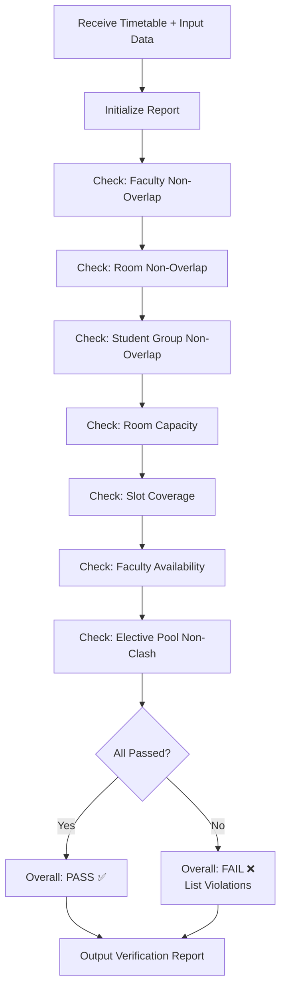

```mermaid
flowchart TD
    A["Receive Timetable + Input Data"] --> B["Initialize Report"]
    B --> C1["Check: Faculty Non-Overlap"]
    C1 --> C2["Check: Room Non-Overlap"]
    C2 --> C3["Check: Student Group Non-Overlap"]
    C3 --> C4["Check: Room Capacity"]
    C4 --> C5["Check: Slot Coverage"]
    C5 --> C6["Check: Faculty Availability"]
    C6 --> C7["Check: Elective Pool Non-Clash"]
    C7 --> D{"All Passed?"}
    D -->|Yes| E["Overall: PASS ✅"]
    D -->|No| F["Overall: FAIL ❌\nList Violations"]
    E --> G["Output Verification Report"]
    F --> G
```
