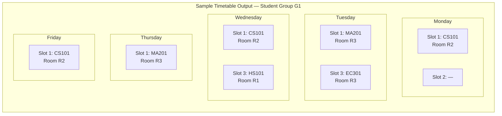

```mermaid
flowchart LR
    subgraph TT["Sample Timetable Output — Student Group G1"]
        direction TB
        subgraph Mon["Monday"]
            M1["Slot 1: CS101\nRoom R2"]
            M2["Slot 2: —"]
        end
        subgraph Tue["Tuesday"]
            T1["Slot 1: MA201\nRoom R3"]
            T2["Slot 3: EC301\nRoom R3"]
        end
        subgraph Wed["Wednesday"]
            W1["Slot 1: CS101\nRoom R2"]
            W2["Slot 3: HS101\nRoom R1"]
        end
        subgraph Thu["Thursday"]
            Th1["Slot 1: MA201\nRoom R3"]
        end
        subgraph Fri["Friday"]
            F1["Slot 1: CS101\nRoom R2"]
        end
    end
```
